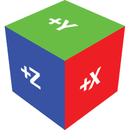
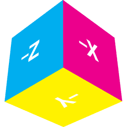

# cube

This module renders the 3D reference cube using OpenGL. It is useful for testing object transformations and debugging OpenGL applictions. The implementation gives a simple example of basic rendering with the [ARB_vertex_buffer_object](http://oss.sgi.com/projects/ogl-sample/registry/ARB/vertex_buffer_object.txt) specification.

To better enable a concrete understanding of 3D transforms, a real-world instance of the 3D reference cube may be constructed from paper or cardstock [using this template PDF](cube.pdf).

-   [cube.c](cube.c)
-   [cube.h](cube.h)
-   [cubepx.png](cubepx.png)
-   [cubenx.png](cubenx.png)
-   [cubepy.png](cubepy.png)
-   [cubeny.png](cubeny.png)
-   [cubepz.png](cubepz.png)
-   [cubenz.png](cubenz.png)

## Compilation

To use this module, simply link it with your own code. It requires OpenGL, [GLEW](http://glew.sourceforge.net/), and the [`image`](image.html#config) utility. To load the cube texture images, the `image` utility requires the PNG libraries.

    cc -o program program.c cube.c image.c -lpng -lz -lGLEW -lGL -lm

## API

- `cube *cube_create(void)`

    Initialize and return a pointer to a new `cube` object. This object contains OpenGL state, so it may be called only *after* the OpenGL context has been initialized.

- `void cube_delete(cube *C)`

    Delete cube `C` and release all OpenGL resources held by it.

- `void cube_render(cube *C)`

    Render cube `C` using the current OpenGL context and state. The necessary texture and vertex array states are pushed to the attribute stack before modification and popped after rendering.

## Textures

The orientation of the texture image applied to each face is significant. It indicates the orientation expected by the OpenGL cube map texture mode. The default textures are each "upright" in their own 2D space.

<table style="margin: auto">
<tr>
<td></td>
<td></td>
<td></td>
<td></td>
<td></td>
<td></td>
</tr>
</table>

On the 3D cube, the four "sides" of the cube remain "upright" as viewed in the default eye space, where the +*y* axis points up. The "top" is oriented with the &minus;*z* axis pointing locally up, and the "bottom" is oriented with the +*z* axis pointing locally up. These orientations must be considered when designing cube map textures. Here is the cube as seen from above and below.

<table style="margin: auto">
<tr>
<td></td>
<td></td>
</tr>
</table>
