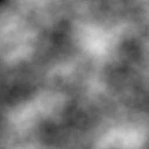
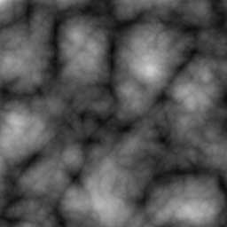

# noise

This module implements a three-dimensional coherent noise generator using the Simplex method of Ken Perlin, as described in <a href="http://www.csee.umbc.edu/~olano/s2002c36/ch02.pdf"><i>Real-Time Shading SIGGRAPH Course Notes (2001)</i>, Chapter 2: Noise Hardware.</a> The output is deterministic, but infinite and non-repeating in all directions.

-   [noise.c](noise.c)
-   [noise.h](noise.h)

## API

- `double noise_sample(double x, double y, double z)`

    Sample the noise function at the point (`x`, `y`, `z`). The output is in the range &minus;1 to +1, though this bound is extremely loose.

- `void noise_buffer(double x, double y, double z, double f, int w, int h, double *v)`

    Generate a monochrome image of coherent noise by sampling the noise function along the Z plane. The point (`x`, `y`, `z`) gives the 3D position of the origin of the 2D sampling. The argument `f` gives a frequency coefficient, where a frequency of one maps the width and height of the buffer onto a 1&times;1 area of the noise function.

The argument `v` points to the output buffer, and `w` and `h` give the width and height of that buffer. After sampling, the values in the output buffer are normalized to the exact range &minus;1 to +1.

## Examples

Coherent noise is usually sampled in several harmonics. Here, assume `p1` through `p7` are `n`&times;`n` buffers. We fill each with a block of coherent noise, sampled at (0.0,&nbsp;0.0,&nbsp;0.5).

    noise_buffer(0.0, 0.0, 0.5,   2.0, n, n, p1);
    noise_buffer(0.0, 0.0, 0.5,   4.0, n, n, p2);
    noise_buffer(0.0, 0.0, 0.5,   8.0, n, n, p3);
    noise_buffer(0.0, 0.0, 0.5,  16.0, n, n, p4);
    noise_buffer(0.0, 0.0, 0.5,  32.0, n, n, p5);
    noise_buffer(0.0, 0.0, 0.5,  64.0, n, n, p6);
    noise_buffer(0.0, 0.0, 0.5, 128.0, n, n, p7);

Different effects can be achieved through different combinations of these harmonics. For example, the basic 1/<i>f</i> noise divides the contribution of each harmonic by its frequency. The sum 1/2 + 1/4 + 1/8 + &hellip; approaches 1 in the limit, so the range of the sum approaches the range of an individual harmonic in the limit. The output in the range &minus;1 to +1 is normalized to the range 0 to 1.

    for (i = 0; i < n * n; ++i)

        p[i] = (1.0 + p1[i] /   2.0
                    + p2[i] /   4.0
                    + p3[i] /   8.0
                    + p4[i] /  16.0
                    + p5[i] /  32.0
                    + p6[i] /  64.0
                    + p7[i] / 128.0) / 2.0;

Here is that result:

The "plasma" effect is achieved by taking the absolute value of each harmonic.

    for (i = 0; i < n * n; ++i)

        p[i] = (1.0 + fabs(p1[i]) /   2.0
                    + fabs(p2[i]) /   4.0
                    + fabs(p3[i]) /   8.0
                    + fabs(p4[i]) /  16.0
                    + fabs(p5[i]) /  32.0
                    + fabs(p6[i]) /  64.0
                    + fabs(p7[i]) / 128.0) / 2.0;

Here is that result:

For more examples and discussion, see Perlin's [noise course notes](http://www.csee.umbc.edu/~olano/s2002c36/ch02.pdf).
