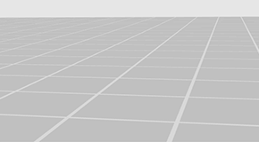

# plane

This module is a very basic OpenGL code that renders a simple gridded plane as on the cover of Edward Tufte's [Visual Explanations](http://www.amazon.com/Visual-Explanations-Quantities-Evidence-Narrative/dp/0961392126). The plane is often useful as a backdrop to simple 3D demos, and can help work through those dreaded blank screen bugs. In addition, it represents an example of basic vertex buffer object creation, population, and rendering.

-   [plane.c](plane.c)
-   [plane.h](plane.h)

## Compilation

To use this module, simply link it with your own code. It requires OpenGL and [GLEW](http://glew.sourceforge.net/).

    cc -o program program.c plane.c -lGLEW -lGL -lm

## API

- `plane *plane_create(int n, float g)`

	Create and return a plane structure. `n` gives the number of tiles in each row and column of the grid. `g` determines the line thickness and gives the fraction of a tile consumed by line. Tufte's grid appears to have a `g` value of around 0.02. The plane is oriented with the Y axis up. Each tile is one unit square in 3D space. It may be rotated, translated, and scaled normally.

- `void   plane_delete(plane *P)`

	Delete the plane structure and release all OpenGL resources held by it.

- `void   plane_render(plane *P)`

	Render the plane using OpenGL.

- `void   plane_color (plane *P, const float *L, const float *F)`

	Change the color of the plane. The `L` and `F` parameters each receive an array of four floats giving red, green, blue, and alpha values for the lines and fills, respectively.

