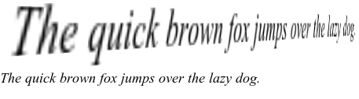
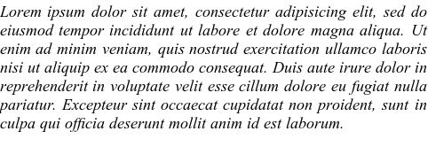
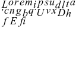
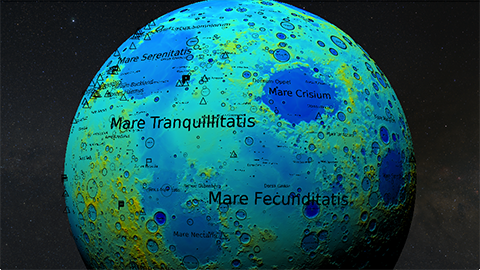

# type

This module implements a mechanism for rendering text using OpenGL. This may be used to add GUI elements and labels in both 3D scenes and in 2D overlays.

-   [type.c](type.c)
-   [type.h](type.h)

A `line` of text is drawn as a series of textured quads using a single `font`. Each quad appears as a single glyph. All quads in a `line` are stored in a single vertex buffer object, and all glyphs in a `font` are represented in a single texture.

Despite its name, one `line` may give many thousands of distinct textual elements, each with an independant 3D transformation. This mechanism enables the very efficient display of great quantities of text with only a single texture binding and a single vertex batch.

## Compilation

To use this module, simply link it with your own code. It requires the [FreeType 2](http://www.freetype.org) library, OpenGL, and [GLEW](http://glew.sourceforge.net/).

    cc -o program program.c type.c -lfreetype2 -lGLEW -lGL -lm

## Font API

- `font *font_create(const void *data, size_t len, int size, float spacing)`

    Create a new font object with the given pixel size and letter spacing. The font file format may be TrueType, OpenType, Type 1, or any other of several formats supported by FreeType. The font data is given in one of two ways:

    - `data` gives the font file name and `len` is unused. Or...

    - `data` gives a font data buffer and `len` gives its length.

    The `size` argument determines both the height of the rendered text in 3D units, and also the resolution of rendered glyphs in pixels. Letter `spacing` allows the space between glyphs to be tuned. Most applications will use a value of 1.0, though slight compression (0.95) or expansion (1.10) is appropriate for some fonts.

- `void font_delete(font *F)`

    Delete font `F` and release all resources held by it.

- `int font_height(font *F)`

    Return the normal line spacing of font `F`. For many fonts this value will be similar to the `size` requested from `font_create`, but this is not guaranteed. When laying out multiple lines of text, applications should prefer this value.

## Line API

- `line *line_create(const char *str, font *F)`

    Create a new line of text set using font `F`. The `str` argument is ASCII, and allows UTF8-encoded UNICODE.

- `line *line_layout(int strc, char **strv, int *expv, double *matv, font *F)`

    Lay out a series of lines of text. This function is a generalization of `line_create` and is called by it with defaul parameters. `strc` gives the number of strings and `strv` gives an array of pointers to strings. `expv` gives an expansion parameter for each string giving the total number of pixels to be inserted into the white space of the line to justify it. This value is calculed using `line_length` described below. Pass `NULL` if no expansion is needed. `matv` gives a 4 x 4 transformation matrix for each string. Each matrix is a list of 16 double precision floats, as expected by OpenGL. Pass `NULL` if no transformation is needed.

- `void line_delete(line *L)`

    Delete line `L` and release all resources held by it.

- `int line_length(line *L)`

    Return the length of line `L`. One pixel equals one unit, so this value gives both the size of the text geometry in 3D units and the horizontal resolution of the rendered text in pixels.

- `void line_render(line *L)`

    Render line `L` using OpenGL.

## Basic Rendering

To generate renderable text, one need only create a `font` structure and one or more `line` structures. Here we load a TrueType font of Times Italic at a size of 18, with a normal letter spacing.

    font *F = font_create("Timesi.TTF", 0, 18, 1.0);
    line *L = line_create("The quick brown fox jumps over the lazy dog.", F);

To render properly, a few pieces of OpenGL state must be set. Text is rendered as textured rectangles, so texture mapping must be enabled. These rectangles may overlap one another, so the depth mask should be false (or the depth test disabled entirely) in order to ensure overlapped glyphs remain visible. Lighting may or may not be desirable for text and, if left enabled, text will respond normally to any light sources in the scene.

    glEnable(GL_TEXTURE_2D);
    glDepthMask(GL_FALSE);
    glDisable(GL_LIGHTING);

To allow the scene to be visible through the text, glyphs are stored in the alpha channel of the texture image. So to appear correctly, they must be blended with the scene using the source alpha value.

    glEnable(GL_BLEND);
    glBlendFunc(GL_SRC_ALPHA, GL_ONE_MINUS_SRC_ALPHA);

With these set, applications need only set a material and the scale, and render. The text will appear in the scene like any other 3D object.

    glColor4d(0.0, 0.0, 0.0, 1.0);
    glScaled(0.01, 0.01, 0.01);
    line_render(Q);

More commonly, text is rendered as a 2D overlay of the scene. To accomplish this, apply an orthogonal projection with the same extent as the window. This will map each unit in eye space to a single pixel in window space, and the text will appear precisely as FreeType rendered it.

    glMatrixMode(GL_PROJECTION);
    glLoadIdentity();
    glOrtho(0, WIN_W, 0, WIN_H, 0, 1);
    glMatrixMode(GL_MODELVIEW);
    glLoadIdentity();
    line_render(Q);

Here is the output of these two examples. Note the sampling artifacts in the scene-embedded text. Higher quality may be achieved with a larger font size, though perfectly sampled text can never be achieved when rendering to a perspective projection.

## Layout

This next example demonstrates the use of `line_layout` to typeset and justify a body of text and, in so doing, explains the use of that function's expansion argument. When presenting fully justified text, each line of input must have roughly the same number of characters. Each line of output will have very nearly the same number of horizontal pixels. To accomplish this, we must determine the exact number of pixels to be inserted.

Assume that we have already divided our text into strings of roughly equal character count, possibly using an automatic mechanism such as Knuth's algorithm:

    const char *strv[] = {
        "Lorem ipsum dolor sit amet, consectetur adipisicing elit, sed do",
        "eiusmod tempor incididunt ut labore et dolore magna aliqua. Ut",
        "enim ad minim veniam, quis nostrud exercitation ullamco laboris",
        "nisi ut aliquip ex ea commodo consequat. Duis aute irure dolor in",
        "reprehenderit in voluptate velit esse cillum dolore eu fugiat nulla",
        "pariatur. Excepteur sint occaecat cupidatat non proident, sunt in",
        "culpa qui of""\xEF\xAC\x81""cia deserunt mollit anim id est laborum."
    };
    int strc = 7;

Note the use of UTF8 in the last line to include the UNICODE "fi" ligature in "officia."

To equalize the lengths of these strings, we begin by using `line_length` to measure the natural length of each. We record these lengths, and note the longest. Then we subtract the longest from each length, giving the amount of expansion that each requires. Traditionally, the last line is not fully justified, so its expansion is set to zero.

    for (i = 0; i < strc - 1; ++i)
    {
        expv[i] = line_length(strv[i], F);
        if (m < expv[i])
            m = expv[i];
    }

    for (i = 0; i < strc - 1; ++i)
        expv[i] = m - expv[i];

    expv[strc - 1] = 0;

    L = line_layout(strc, strv, expv, NULL, F);

The array of strings and array of expansion values is passed to `line_layout`. In this example, the transformation matrix is unsused and a NULL pointer is passed. In this case `line_layout` will set all lines in a column.

The result is a single `line` structure that encapsulates several lines of text, Here is the output, rendered in Times Italic at 18:

As a peek behind the curtain, here is the texture atlas generated during the execution of this example. It's square, and only the top half is used. A little bit of texture memory goes a long way when rendering text.

The use of the transformation matrix parameter exposes the full generality of `line_layout`. In this image, nearly 9000 lunar feature labels were typeset and transformed to their correct locations with appropriate scaling. All 9000 labels were rendered using a single vertex array and only a tiny texture.

